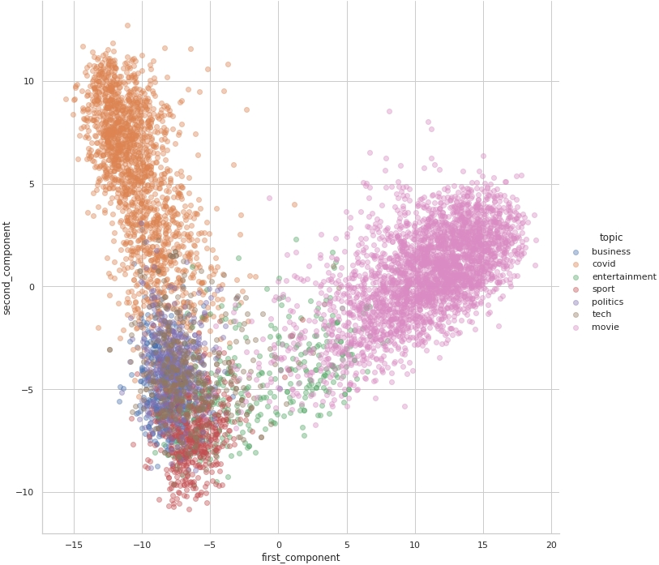

# Recommendation System

Development of a recommendation service that will return posts for each user at any time based on previously liked texts.

The quality of the written service is evaluated in a checker based on hidden data. The set of users is fixed and no new ones will appear. Application should process the request in less than 0.5 seconds.

Posts can remain relevant for several months, so it makes sense to dive into the analysis of the texts themselves: sentiment (negative, neutral and positive), word and paragraph count, and hour/month/week/weekday of publication

The main idea is to use [Cosine similarity](https://www.sciencedirect.com/topics/computer-science/cosine-similarity) - a measure of similarity between two sequences of numbers. It is measured by the cosine of the angle between two vectors and determines whether two vectors are pointing in roughly the same direction. This method can be used as a measurement of how similar are posts in a given social network.

  

## Let's simulate a recommender system: user likes some post, and we show n similar posts (first 500 characters)

#### Liked post
Asian quake hits European shares

Shares in Europes leading reinsurers and travel firms have fallen as the scale of the damage wrought by tsunamis across south Asia has become apparent.

More than 23,000 people have been killed following a massive underwater earthquake and many of the worst hit areas are popular tourist destinations. Reisurance firms such as Swiss Re and Munich Re lost value as investors worried about rebuilding costs. But the disaster has little impact on stock markets in the  

#### The number 1 recommended post: 
Disaster claims less than $10bn

Insurers have sought to calm fears that they face huge losses after an earthquake and giant waves killed at least 38,000 people in southern Asia.

Munich Re and Swiss Re, the worlds two biggest reinsurers, have said exposure will be less than for other disasters. Rebuilding costs are likely to be cheaper than in developed countries, and many of those affected will not have insurance, analysts said. Swiss Re has said total claims are likely to be less than $10bn

#### The number 2 recommended post: 
Asia shares defy post-quake gloom

Thailand has become the first of the 10 southern Asian nations battered by giant waves at the weekend to cut its economic forecast.

Thailands economy is now expected to grow by 5.7% in 2005, rather than 6% as forecast before tsunamis hit six tourist provinces. The full economic costs of the disaster remain unclear. In part, this is because of its scale, and because delivering aid and recovering the dead remain priorities. But Indonesian, Indian and Hong Kong 

#### The number 3 recommended post: 
Booming markets shed few tears

The market, former British government minister Michael Heseltine once said, has no morality.

And indeed, stock exchange traders around Asia have wasted little time regretting the victims of this weeks disaster. Stock markets in Indonesia and India have hit all-time highs this week; even in Sri Lanka, more comprehensively affected, the main index has lost only 5% since the waves hit. Bigger markets further afield have barely twitched. The MSCI World share index, 
